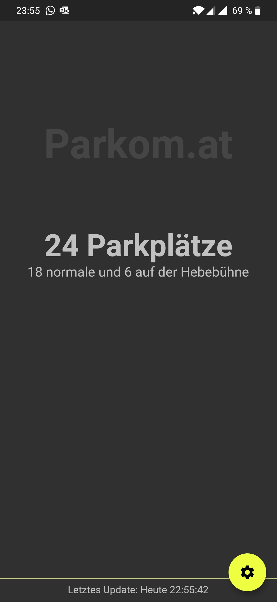

= Parkom.at =

A beautiful app for your parkomat.

== Features ==

- [x] Well, shows how many parking spots are free

== Installation ==

The app is not (yet?) available on the stores yet, so you have to follow the guides from the flutter guys for
link:https://flutter.dev/docs/get-started/install/macos[mac], link:https://flutter.dev/docs/get-started/install/linux[linux]
and link:https://flutter.dev/docs/get-started/install/windows[windows] to build the apk by yourself.

For better performace use the `--release` flag for `flutter run` -> `flutter run --release`

Android users can also download a prebuilt apk from the link:https://github.com/kevinraddatz/parkomat-mobile/releases/tag/1.1.0.RELEASE[v1.1.0 release].

== Some inspirations ==

